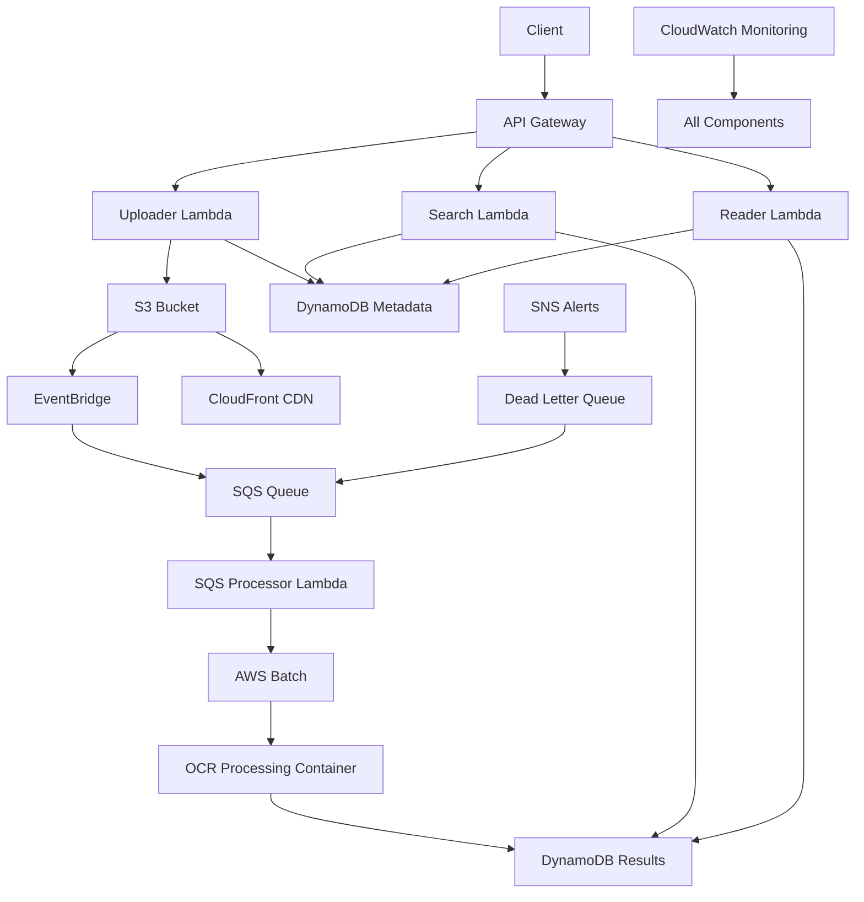

# Serverless OCR Document Processing & Search System(LLM's version)

A production-ready serverless OCR document processing pipeline with advanced fuzzy search capabilities, built with AWS services and Terraform. This system provides intelligent document analysis, semantic text processing, and enterprise-grade search functionality.

[](https://opensource.org/licenses/MIT)
[](https://aws.amazon.com/)
[](https://terraform.io/)
[](https://python.org/)

## 🏗️ Architecture Overview



## ✨ Key Features

### 🔍 **Advanced Search Capabilities**
- **Fuzzy Search**: RapidFuzz-powered approximate matching with configurable similarity thresholds
- **Semantic Text Processing**: Searches refined, processed text for better relevance
- **Multi-field Search**: Search across metadata (title, author, publication) and full OCR content
- **Context Snippets**: Intelligent excerpt extraction with relevance scoring
- **Flexible Queries**: Exact matching, partial matching, and topic-based discovery

### 📄 **Document Processing Pipeline**
- **Intelligent OCR**: AWS Textract integration with confidence scoring
- **Text Refinement**: Semantic processing for improved searchability
- **Metadata Extraction**: Automatic publication, author, and subject detection
- **Multi-format Support**: Images (JPEG, PNG), PDFs, and document formats
- **Scalable Processing**: AWS Batch with auto-scaling containers

### 🚀 **Production-Ready Architecture**
- **Serverless First**: Lambda, DynamoDB, and managed services
- **Cost Optimized**: VPC Endpoints, pay-per-use pricing, lifecycle policies
- **Auto-scaling**: Elastic compute resources based on demand
- **Global CDN**: CloudFront for fast file delivery worldwide
- **Comprehensive Monitoring**: CloudWatch, SNS alerts, and operational dashboards

### 🔒 **Enterprise Security**
- **Multi-tier Rate Limiting**: Public, registered, and premium access tiers
- **API Key Management**: Secure authentication for higher usage limits
- **Network Isolation**: Private subnets with VPC endpoints
- **Encryption**: At-rest and in-transit encryption for all data
- **IAM Best Practices**: Least privilege access with service-specific roles

## 🎯 Business Value

This system demonstrates modern cloud architecture principles and provides:

- **Historical Document Digitization**: Convert physical documents to searchable digital archives
- **Research Platform**: Academic and institutional document discovery
- **Enterprise Knowledge Management**: Corporate document processing and search
- **Document Compliance**: Automated processing for regulatory requirements
- **Data Discovery**: Topic-based content exploration and analysis

## 🚀 Quick Start

### Prerequisites

- AWS CLI configured with appropriate permissions
- Terraform >= 1.0 installed
- Docker installed and running
- Python 3.9+ for local development

### 1. Deploy Infrastructure

```bash
# Clone repository
git clone <repository-url>
cd OCR-AWS-Batch-Serverless-Python

# Initialize Terraform
terraform init

# Review and customize configuration
cp terraform.tfvars.example terraform.tfvars
# Edit terraform.tfvars with your settings

# Deploy infrastructure
terraform plan
terraform apply
```

### 2. Build and Deploy Dependencies

```bash
# Build and deploy Docker container
terraform output deployment_commands
# Follow the ECR login and Docker build commands
```

### 3. Test the System

```bash
# Get API endpoints
terraform output api_endpoints

# Test document upload
curl -X POST "$(terraform output -json api_endpoints | jq -r '.upload')" \
  -H "Content-Type: multipart/form-data" \
  -F "file=@sample-document.pdf" \
  -F "metadata={\"publication\":\"Nature\",\"year\":\"2024\",\"title\":\"AI Research\"}"

# Search documents with fuzzy matching
curl "$(terraform output -json api_endpoints | jq -r '.search')?q=artificial+intelligence&fuzzy=true&fuzzyThreshold=80"

# Get processed document by ID
curl "$(terraform output -json api_endpoints | jq -r '.processed')?fileId=YOUR_FILE_ID"
```

## 📊 API Reference

### Upload Document
```http
POST /upload
Content-Type: multipart/form-data

file: <binary data>
metadata: {
  "publication": "The Scientific Journal",
  "year": "1925",
  "title": "Electric Cars of Tomorrow",
  "author": "Dr. Emily Johnson",
  "description": "Vision of electric transportation",
  "tags": ["electric", "cars", "future"]
}
```

### Search Documents
```http
GET /search?q={term}&fuzzy={true|false}&fuzzyThreshold={0-100}
GET /search?publication={name}&year={year}&title={title}
GET /search?q={term}&limit={10}&offset={0}
```

**Search Parameters:**
- `q`: Search term for full-text search
- `fuzzy`: Enable fuzzy matching (default: false)
- `fuzzyThreshold`: Similarity percentage for fuzzy search (default: 80)
- `publication`: Filter by publication name
- `year`: Filter by publication year
- `title`: Filter by document title
- `status`: Filter by processing status
- `limit`: Number of results to return (max: 100)

**Response Format:**
```json
{
  "success": true,
  "message": "Found 15 results",
  "query": {
    "searchTerm": "electric vehicles",
    "fuzzy": true,
    "fuzzyThreshold": 80
  },
  "results": [
    {
      "fileId": "a73f480f-69f3-4b8c-84c9-724eb5dbce1a",
      "fileName": "electric-cars-1925.pdf",
      "status": "processed",
      "fileUrl": "https://d18y62axs8f574.cloudfront.net/...",
      "metadata": {
        "publication": "The Morning Chronicle",
        "year": "1925",
        "title": "Electric Cars of Tomorrow",
        "author": "Dr. Emily Johnson"
      },
      "ocrResults": {
        "refinedText": "Transport for Tomorrow...",
        "pageCount": 5
      },
      "snippet": "...electric cars will revolutionize transportation...",
      "fuzzyScore": 92
    }
  ],
  "totalResults": 15,
  "hasMore": true
}
```

### Get Processed Documents
```http
GET /processed?fileId={id}
GET /processed?status={processing|completed|failed}
GET /processed?limit={10}
```

## 🔍 Search Capabilities

### Exact Search
- **Publication Search**: Find documents by publication name
- **Author Search**: Search by author names
- **Title Search**: Match document titles
- **Full-text Search**: Search within OCR-extracted content
- **Year Filter**: Filter by publication year
- **Status Filter**: Filter by processing status

### Fuzzy Search
- **Typo Tolerance**: Handles misspellings and variations
- **Similarity Scoring**: Configurable match thresholds (0-100%)
- **Semantic Matching**: Searches processed, refined text
- **Context Aware**: Provides relevant text snippets
- **Ranking**: Results sorted by relevance score

### Search Examples

```bash
# Exact search for electric vehicles
curl "https://api.example.com/search?q=electric+vehicles"

# Fuzzy search with typos
curl "https://api.example.com/search?q=electrik+vehicals&fuzzy=true&fuzzyThreshold=75"

# Search by publication and year
curl "https://api.example.com/search?publication=Nature&year=2024"

# Topic-based search
curl "https://api.example.com/search?q=climate+change+renewable+energy&fuzzy=true"

# Combined search with filters
curl "https://api.example.com/search?q=transportation&year=1925&fuzzy=true&limit=20"
```

## 🏗️ Infrastructure Components

### Core Services
| Component | Purpose | Technology |
|-----------|---------|------------|
| **API Gateway** | REST API endpoints with rate limiting | AWS API Gateway |
| **Lambda Functions** | Serverless compute for processing | AWS Lambda (Python 3.9) |
| **Document Storage** | Secure file storage with CDN | AWS S3 + CloudFront |
| **Database** | Metadata and search indices | AWS DynamoDB |
| **OCR Processing** | Document text extraction | AWS Batch + Textract |
| **Search Engine** | Fuzzy search capabilities | RapidFuzz Library |
| **Monitoring** | Observability and alerting | CloudWatch + SNS |

### Lambda Functions
| Function | Purpose | Memory | Timeout |
|----------|---------|---------|----------|
| **Uploader** | Handle file uploads and metadata | 256 MB | 5 min |
| **Search** | Process search queries with fuzzy matching | 512 MB | 1 min |
| **Reader** | Retrieve processed documents | 256 MB | 1 min |
| **SQS Processor** | Submit batch jobs for OCR processing | 256 MB | 1 min |
| **Batch Reconciliation** | Update processing status | 256 MB | 1 min |
| **Dead Job Detector** | Clean up failed processing jobs | 256 MB | 5 min |

### Storage & CDN
- **S3 Bucket**: Encrypted document storage with lifecycle policies
- **CloudFront**: Global content delivery network
- **DynamoDB**: NoSQL database with auto-scaling
- **ECR**: Private container registry for batch processing

## 💰 Cost Optimization

### Architecture Savings
- **VPC Endpoints**: Save $75-105/month vs NAT Gateways
- **Serverless**: Pay-per-use model, no idle costs
- **Auto-scaling**: Resources scale with demand
- **Lifecycle Policies**: Automatic cleanup of old data

### Monthly Cost Estimate (ap-southeast-2)
| Service | Estimated Cost | Description |
|---------|----------------|-------------|
| VPC Endpoints | $43.20 | Private AWS service access |
| DynamoDB | $5-25 | Pay-per-request pricing |
| Lambda | $2-10 | Execution-based billing |
| S3 Storage | $1-20 | Document storage |
| CloudFront | $1-10 | Global CDN |
| Batch Processing | $5-50 | Fargate compute time |
| **Total** | **$57-158** | **Scales with usage** |

**Annual Savings**: $900-1,260 vs traditional EC2/RDS setup

## 🔐 Security & Compliance

### Network Security
- **Private Subnets**: Compute resources isolated from internet
- **VPC Endpoints**: Secure AWS service communication
- **Security Groups**: Least privilege network access
- **HTTPS Only**: TLS 1.2+ for all API communications

### Data Protection
- **Encryption at Rest**: S3 and DynamoDB encryption
- **Encryption in Transit**: HTTPS/TLS for all data transfer
- **Access Control**: IAM roles with minimal permissions
- **API Authentication**: Multi-tier rate limiting with API keys

### Rate Limiting Tiers
| Tier | API Key | Rate Limit | Burst Limit | Daily Quota |
|------|---------|------------|-------------|-------------|
| **Public** | Not Required | 10/sec | 20 | 1,000 |
| **Registered** | Required | 50/sec | 100 | 10,000 |
| **Premium** | Required | 200/sec | 400 | 100,000 |

## 📈 Monitoring & Operations

### CloudWatch Integration
- **Real-time Metrics**: API requests, processing times, error rates
- **Custom Dashboards**: Business and technical KPIs
- **Automated Alerts**: SNS notifications for failures
- **Log Aggregation**: Centralized logging across all services

### Operational Commands
```bash
# View all infrastructure outputs
terraform output

# Check system health
terraform output troubleshooting

# Monitor processing pipeline
aws logs tail /aws/lambda/ocr-processor-* --follow

# View cost optimization summary
terraform output cost_summary

# Check search performance
curl "$(terraform output -json api_endpoints | jq -r '.search')?q=test"
```

### Troubleshooting

**Common Issues:**
1. **Search not returning results**: Check document processing status
2. **Rate limiting errors**: Use API keys for higher limits
3. **Upload failures**: Verify file format and size limits
4. **Processing delays**: Monitor AWS Batch queue status

**Debug Commands:**
```bash
# Check processing status
curl "$(terraform output -json api_endpoints | jq -r '.processed')?status=processing"

# View failed jobs
aws batch list-jobs --job-queue $(terraform output -json batch | jq -r '.job_queue_name') --job-status FAILED

# Check dead letter queue
aws sqs receive-message --queue-url $(terraform output -json sqs | jq -r '.dead_letter_queue.url')
```

## 🛠️ Configuration

### Essential Variables (terraform.tfvars)
```hcl
# Basic Configuration
aws_region = "ap-southeast-2"
project_name = "ocr-processor"
environment = "production"

# Rate Limiting
enable_rate_limiting = true
public_rate_limit = 10
registered_rate_limit = 50
premium_rate_limit = 200

# Cost Optimization
enable_ssm_endpoints = false  # Save $21.60/month
```

### Advanced Configuration
```hcl
# Auto-cleanup Settings
cleanup_age_hours = 24
cleanup_schedule_expression = "rate(6 hours)"

# Processing Configuration
batch_job_timeout = 3600
max_concurrent_jobs = 100

# Search Configuration
default_fuzzy_threshold = 80
max_search_results = 100
```

## 🎯 Use Cases

### Academic Research
- **Historical Document Archives**: Digitize and search historical publications
- **Literature Review**: Find relevant papers by topic and content
- **Citation Analysis**: Extract and search academic references

### Enterprise Applications
- **Document Management**: Corporate knowledge base with search
- **Compliance**: Regulatory document processing and discovery
- **Research & Development**: Technical document analysis

### Government & Libraries
- **Digital Archives**: Public record digitization and access
- **Historical Research**: Citizen access to historical documents
- **Preservation**: Digital preservation of physical documents

## 📁 Project Structure

```
OCR-AWS-Batch-Serverless-Python/
├── Infrastructure (Terraform)
│   ├── versions.tf              # Provider configurations
│   ├── variables.tf             # Input variables
│   ├── vpc.tf                   # VPC and networking
│   ├── iam.tf                   # IAM roles and policies
│   ├── ecr.tf                   # Container registry
│   ├── batch.tf                 # AWS Batch configuration
│   ├── lambda.tf                # Lambda functions
│   ├── api_gateway.tf           # API Gateway and rate limiting
│   ├── dynamodb.tf              # Database tables
│   ├── s3.tf                    # Storage and CDN
│   ├── cloudwatch.tf            # Monitoring and logging
│   ├── sqs.tf                   # Message queues
│   ├── eventbridge.tf           # Event routing
│   ├── cleanup.tf               # Auto-cleanup system
│   └── outputs.tf               # Output values
│
├── Lambda Functions
│   ├── s3_uploader/             # File upload handler
│   ├── lambda_reader/           # Document retrieval
│   ├── document_search/         # Fuzzy search engine
│   │   ├── document_search.py   # Search logic with RapidFuzz
│   │   └── requirements.txt     # Python dependencies
│   ├── sqs_to_batch_submitter/  # Batch job submission
│   ├── batch_status_reconciliation/ # Status updates
│   ├── dead_job_detector/       # Job cleanup
│   └── cleanup_processor/       # Resource cleanup
│
├── AWS Batch Container
│   ├── Dockerfile              # OCR processing container
│   ├── index.py                # Python OCR application
│   └── requirements.txt        # Container dependencies
│
├── Build Scripts
│   └── .gitignore              # Comprehensive ignore patterns
│
└── Documentation
    ├── README.md               # This file
    └── terraform.tfvars.example # Configuration template
```

## 🚀 Advanced Features

### Semantic Search Enhancement
- **Text Preprocessing**: Automatic text cleaning and normalization
- **Named Entity Recognition**: Extract people, places, organizations
- **Topic Modeling**: Automatic subject categorization
- **Relevance Scoring**: Advanced ranking algorithms

### Performance Optimization
- **Caching Strategy**: API Gateway and Lambda caching
- **Connection Pooling**: Optimized database connections
- **Batch Processing**: Parallel document processing
- **CDN Optimization**: Global content delivery

### Future Enhancements
- **Machine Learning**: Content classification and recommendation
- **Multi-language Support**: OCR and search in multiple languages
- **Real-time Processing**: WebSocket-based status updates
- **Advanced Analytics**: Usage patterns and search insights

## 🤝 Contributing

We welcome contributions! Please see our contributing guidelines:

1. **Fork** the repository
2. **Create** a feature branch
3. **Make** your changes with tests
4. **Submit** a pull request

### Development Setup
```bash
# Clone repository
git clone <repository-url>
cd OCR-AWS-Batch-Serverless-Python

# Install dependencies
pip install -r lambda_functions/document_search/requirements.txt

# Run local tests
python -m pytest tests/

# Lambda packages are built automatically by Terraform
```

## 📄 License

This project is licensed under the MIT License - see the [LICENSE](LICENSE) file for details.

## 🆘 Support

For questions and support:

1. **Documentation**: Check this README and Terraform outputs
2. **Issues**: Submit GitHub issues for bugs or feature requests  
3. **Discussions**: Use GitHub Discussions for questions
4. **Monitoring**: Use CloudWatch dashboards for operational insights

### Getting Help
```bash
# Get all available outputs
terraform output

# Get troubleshooting information
terraform output troubleshooting

# Check system architecture
terraform output architecture

# View API examples
terraform output api_examples
```

---

**Built with ❤️ using AWS, Terraform, and Python**

*Demonstrating modern serverless architecture, advanced search capabilities, and production-ready document processing.*